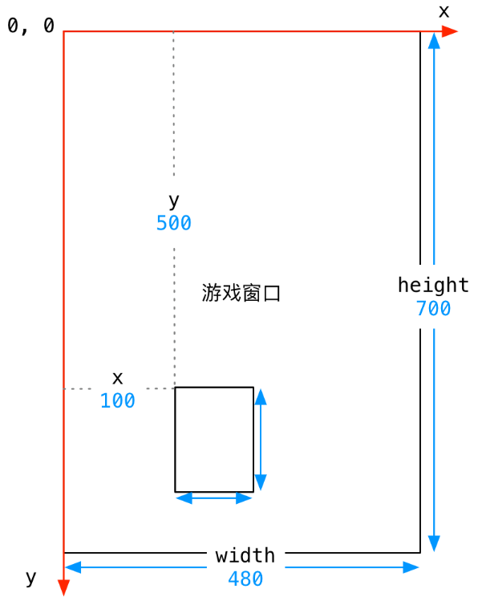
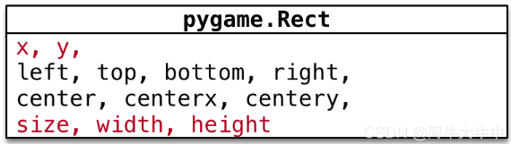
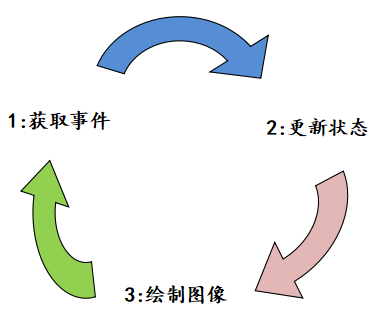

# 一、项目介绍

## 1.1 编程环境

- python 3.9

- pygame 2.1.2

## 1.2 pygame模块安装

安装

```
pip install pygame
```


# 二、 pygame关键点

## 2.1 类模板

class Player(pygame.sprite.Sprite):
  def __init__(self):
    pygame.sprite.Sprite.__init__(self)

```
class Player(pygame.sprite.Sprite):
  def __init__(self):
    pygame.sprite.Sprite.__init__(self)
```


## 2.2 游戏坐标系

- **原点** 在 **左上角** `(0, 0)`
- **x轴**水平方向向右，逐渐增加
-  **y轴**垂直方向向下，逐渐增加




- 在游戏中，**所有可见的元素** 都是以 **矩形区域** 来描述位置的
  - 要描述一个矩形区域有四个要素：`(x, y) (width, height)`
- `pygame` 专门提供了一个类 `pygame.Rect` 用于描述 **矩形区域**




## 2.3 碰撞检测

主要包括以下方法：

- pygame.sprite.groupcollide（）
- pygame.sprite.spritecollide()


# 三、项目实践

## 2.1 游戏框架

> [Pygame程序框架参考](http://c.biancheng.net/pygame/the-first-programm.html)

游戏主循环是每个 Pygame 游戏程序中必不可少的一部分，它主要承担着以下三个重要任务：

- 处理游戏事件
- 更新游戏状态
- 把更新后的游戏状态绘制到屏幕上



```
import pygame

# 游戏状态常量
FPS=60                  # 帧率
WIDIH = 500             # 游戏窗口宽度
HEIGHT = 600            # 游戏窗口高度
WHILE = (255, 255, 255)   # 背景填充颜色
GREEN = (0, 250, 0)

# 游戏初始化（必须）
pygame.init()

# 设置主屏窗口
screen = pygame.display.set_mode((WIDIH, HEIGHT))

# 设置窗口的标题，即游戏名称
pygame.display.set_caption('飞机大战')

# 创建一个时钟对象来帮我们确定游戏要以多大的帧数运行
clock = pygame.time.Clock()


# 固定代码段，实现点击"X"号退出界面的功能，几乎所有的pygame都会使用该段代码
running =True
while running:
    #
    clock.tick(FPS)
    # 循环获取事件，监听事件状态
    for event in pygame.event.get():
        # 判断用户是否点了"X"关闭按钮,并执行if代码段
        # pygame.QUIT 指点击右上角窗口的"X"号
        if event.type == pygame.QUIT:
            running =False
    # 填充屏幕颜色
    screen.fill(WHILE) 
    # 刷新屏幕
    pygame.display.update()

# 卸载所有模块
pygame.quit()

```


## 2.2 角色移动

创建某一个角色（此时为矩形）

```
class Player(pygame.sprite.Sprite):
  def __init__(self):
    pygame.sprite.Sprite.__init__(self)
    # 创建 一个50*40 的图像
    self.image = pygame.Surface((50, 40))
    self.image.fill(GREEN)
    # 设置角色轮廓
    self.rect = self.image.get_rect()
    self.rect.center = (WIDIH/2, HEIGHT/2)

  def update(self):
      self.rect.x += 3
      if self.rect.left > WIDIH:
          self.rect.x = 0
```

通过不断循环**update(self)**方法 ， 即可实现角色的移动

```
# 固定代码段，实现点击"X"号退出界面的功能，几乎所有的pygame都会使用该段代码
running =True
while running:
    #
    clock.tick(FPS)
    # 循环获取事件，监听事件状态
    for event in pygame.event.get():
        # 判断用户是否点了"X"关闭按钮,并执行if代码段
        # pygame.QUIT 指点击右上角窗口的"X"号
        if event.type == pygame.QUIT:
            running =False

    # 更新游戏
    all_sprites.update()
    
    # 显示画面
    screen.fill(WHILE) # 填充屏幕颜色
    all_sprites.draw(screen) # 将角色画上去
    pygame.display.update() # 刷新屏幕
```


## 2.3 控制角色移动

通过`pygame.key.get_pressed()`获取 按键 从而 移动角色。

主要实现代码在角色的update()里面：

```
  def update(self):
    # 获取键盘按键
    key_pressed = pygame.key.get_pressed()

    # 根据按键移动角色
    if key_pressed[pygame.K_RIGHT]:
        self.rect.x += self.speedx
    if key_pressed[pygame.K_LEFT]:
        self.rect.x -= self.speedx

    # 避免穿墙
    if self.rect.right > WIDIH:
        self.rect.right = WIDIH
    if self.rect.left < 0:
        self.rect.left = 0
```


## 2.4 陨石掉落

主要问题：

- 随机生成不同位置的陨石
- 陨石左右移动
- 使陨石不间断地出现在舞台

```
# 陨石角色
class Rock(pygame.sprite.Sprite):
    def __init__(self):
        pygame.sprite.Sprite.__init__(self)
        # 创建 一个50*40 的图
        self.image = pygame.Surface((50, 40))
        self.image.fill(RED)
        # 设置角色轮廓,随机生成不同位置的陨石
        self.rect = self.image.get_rect()
        self.rect.x = random.randrange(0, WIDIH - self.rect.width)
        self.rect.y = random.randrange(-100, -40)
        # 设置陨石速度，使陨石左右移动
        self.speedx = random.randrange(-4, 4)
        self.speedx = random.randrange(3, 10)

    def update(self):
        self.rect.x += self.speedx
        self.rect.y += self.speedy
        # 使陨石不间断地出现在舞台
        # 当陨石消失屏幕后，生成一个新的陨石
        if self.rect.top > HEIGHT or self.rect.left > WIDIH or self.rect.right < 0:
            # 设置角色轮廓,随机生成不同位置的陨石
            self.rect.x = random.randrange(0, WIDIH - self.rect.width)
            self.rect.y = random.randrange(-100, -40)
            # 设置陨石速度，使陨石左右移动
            self.speedx = random.randrange(-4, 4)
            self.speedx = random.randrange(3, 10)
```


## 2.5 实现射击子弹

（1）创建子弹类，满足以下要求：

-  子弹位置应该在飞机位置
-  只有y坐标变换（向上移动）
-  当子弹到达顶部时，会消失

```
class Bullet(pygame.sprite.Sprite):
    def __init__(self, x, y):
        pygame.sprite.Sprite.__init__(self)
        # 创建 一个50*40 的图
        self.image = pygame.Surface((10, 20))
        self.image.fill(YELLOW)
        # 设置子弹轮廓, 子弹位置应该在飞机位置
        self.rect = self.image.get_rect()
        self.rect.x = x
        self.rect.y = y
        # 设置子弹速度，只有y坐标变换（向上移动）
        self.speedy = -10

    def update(self):
        self.rect.y += self.speedy
        # 当子弹到达顶部时，会消失
        if self.rect.bottom < 0:
            self.kill()  # 删除克隆体
```

（2）飞机应该还要添加一个发射方法：

```
# 飞机发射子弹函数
    def shoot(self):
        bullet = Bullet(self.rect.centerx, self.rect.centery)
        all_sprites.add(bullet)
        bullets.add(bullet)
```

飞机发射子弹，是通过空格按键实现的，要在在游戏主循环中添加以下代码：

```
# 判断用户是否点了"X"关闭按钮,并执行if代码段
        # pygame.QUIT 指点击右上角窗口的"X"号
        if event.type == pygame.QUIT:
            running =False
        elif event.type == pygame.KEYDOWN:  # 判断事件是按下了某个键
            if event.key == pygame.K_SPACE:  # 判断按下了空格键
                player.shoot()  # 飞机发射子弹
```


（3）子弹和陨石碰撞后，会消失。其中，子弹和陨石都由列表rocks, bullets分别存储。

在游戏主循环中添加以下代码

```
 hits_rockandbullet = pygame.sprite.groupcollide(rocks, bullets, True, True)  # 子弹和陨石碰撞后会消失
    for hit in hits_rockandbullet:  # 当消灭陨石，会生成相应数量的陨石
        r = Rock()
        all_sprites.add(r)
        rocks.add(r)
```


（4）飞机和陨石相撞后，游戏介绍，在游戏主循环中添加以下代码：

```
 hits_rockandbullet = pygame.sprite.spritecollide(player, rocks,  True)  # 玩家和陨石碰撞后会消失
    if hits_rockandbullet:  # 当陨石和飞机相撞后，游戏结束
        running = False
```


## 2.6 引入声音和图片

（1）引入图片主要包括

- 加载图片
- 调用图片

以背景图片为例：

```
# 加载图片
background_img = pygame.image.load(os.path.join("img", "background.png")).convert()
```

```
# 在主程序中绘制
screen.blit(background_img, (0, 0))
```

（2）引入声音主要包括

- 加载声音
- 调用声音

以飞机发射子弹为例：

```
shoot_sound = pygame.mixer.Sound(os.path.join("sound", "shoot.wav"))
```

```
 shoot_sound.play()
```

（3）引入背景音乐

```
# 加载背景音乐
pygame.mixer.music.load(os.path.join("sound", "background.ogg"))
pygame.mixer.music.set_volume(0.3)
```

```
pygame.mixer.music.play()  # 播放背景音乐
```


## 2.7 陨石优化

为了使陨石和飞机相撞自然，可以利用飞机和陨石的圆形轮廓碰撞来代替之前的矩形轮廓相撞

```
# 设置飞机的圆形轮廓，使飞机和陨石碰撞自然
 self.radius = 23
 self.draw.circle(self.image, RED, self.rect.center, self.radius)

 # 设置陨石的圆形轮廓，使飞机和陨石碰撞自然
  self.radius = self.rect.width / 2.2
  self.draw.circle(self.image, RED, self.rect.center, self.radius)

# pygame.sprite.collide_circle表示相撞方式
hits_rockandbullet = pygame.sprite.spritecollide(player, rocks,  False, pygame.sprite.collide_circle)  # 玩家和陨石碰撞后会消失

```

为了保证旋转自然，让角色每次旋转的时候，轮廓重新绘制

```
    def rotate(self):
        self.total_degree = self.total_degree + self.rot_degree
        self.image = pygame.transform.rotate(self.image_origin, self.total_degree)
        center = self.rect.center
        self.rect = self.image.get_rect()
        self.rect.center = center
```


2.8 爆炸与得分

（1）得分设计

利用score全局变量表示得分

陨石半径表示飞机摧毁陨石所相应获得的分数

在游戏主循环中添加以下代码：

```
  hits_rockandbullet = pygame.sprite.groupcollide(rocks, bullets, True, True)  # 子弹和陨石碰撞后会消失
    for hit in hits_rockandbullet:  # 当消灭陨石，会生成相应数量的陨石
        random.choice(expl_sounds).play()
        new_rock()  # 生成新的陨石
        score = score + int(hit.radius)

```

绘制函数：

```
# 绘制得分
# surf:绘制到哪里， text: 绘制内容， （x,y）:坐标
def draw_text(surf, text, size, x, y):
    font = pygame.font.Font(font_name, size)
    text_surface = font.render(text, True, WHITE)  # 渲染
    text_rect = text_surface.get_rect()
    text_rect.centerx = x
    text_rect.top = y
    surf.blit(text_surface, text_rect)
```

（2）血量值设计

在player类里面设置一个变量health, 表示玩家的血量值

在游戏主循环中添加以下代码：

```
 hits_playerandrock = pygame.sprite.spritecollide(player, rocks,  False, pygame.sprite.collide_circle)  # 玩家和陨石碰撞后会消失
    for hit in hits_playerandrock: # 当消灭陨石，会生成相应数量的陨石
        player.health = player.health - hit.radius
```

绘制函数：

```
# 绘制血量条
def draw_health(surf, hp, x, y):
    if hp < 0 :
        hp = 0
    BAR_LENGTH = 100
    BAR_HEIGHT = 10
    fill = (hp/100) * BAR_LENGTH  # 血量条真正长度
    outline_rect = pygame.Rect(x, y, BAR_LENGTH, BAR_HEIGHT) # 血量条外框（矩形）
    fill_rect = pygame.Rect(x, y, fill, BAR_HEIGHT)  # 血量条（矩形）
    pygame.draw.rect(surf, GREEN, fill_rect)
    pygame.draw.rect(surf, WHITE, outline_rect, 2)

```

（3）生命条设计

在player类里面设置一个变量lives, 表示玩家的生命数量

在游戏主循环中添加以下代码：

```
hits_playerandrock = pygame.sprite.spritecollide(player, rocks,  False, pygame.sprite.collide_circle)  # 玩家和陨石碰撞后会消失
    for hit in hits_playerandrock: # 当消灭陨石，会生成相应数量的陨石
        player.health = player.health - hit.radius
        new_rock()  # 生成新的陨石
        # 当陨石和飞机相撞后，游戏结束
        if player.health <= 0:
            player.lives = player.lives - 1
            player.health = 100
            player.hide()
        if player.lives == 0:
            running = False
```

绘制函数：

```
# 绘制生命条
def draw_lives(surf, lives, img, x, y):
    for i in range(lives):
        img_rect = img.get_rect()
        img_rect.x = x + 30*i
        img_rect.y = y
        surf.blit(img, img_rect)
```


## 2.9爆炸与宝箱

(1)爆炸

爆炸特效实现思路：每次爆炸由许多张图片在较短的时间内连续播放来实现的

用字典存放爆炸特效

```
# 用字典存放爆炸特效
expl_anim = {}
expl_anim['lg'] = []  # ‘lg’:large ,  大的陨石爆炸特效
expl_anim['sm'] = []  # 'sm':small ， 小的陨石爆炸特效
expl_anim['player'] = []  # 飞船爆炸特效
for i in range(9):
    expl_img = pygame.image.load(os.path.join("img", f"expl{i}.png")).convert()
    expl_img.set_colorkey(BLACK)
    expl_anim['lg'].append(pygame.transform.scale(expl_img, (75, 75)))
    expl_anim['sm'].append(pygame.transform.scale(expl_img, (30, 30)))
    player_expl_img = pygame.image.load(os.path.join("img", f"player_expl{i}.png")).convert()  # 飞船爆炸特效
    player_expl_img.set_colorkey(BLACK)
    expl_anim['player'].append(player_expl_img)
```

创建爆炸特效类

```
# 爆炸特效
class Explosion(pygame.sprite.Sprite):
    def __init__(self, center, size):
        pygame.sprite.Sprite.__init__(self)
        self.size = size
        self.image = expl_anim[self.size][0]

        # 设置轮廓
        self.rect = self.image.get_rect()
        self.rect.center = center

        # 每次爆炸由许多张图片来实现的。图片数量用frame表示
        self.frame = 0

        self.last_update = pygame.time.get_ticks()

    def update(self):
        now = pygame.time.get_ticks()
        if now - self.last_update > 50:
            self.last_update = now
            self.frame = self.frame + 1
            if self.frame == len(expl_anim[self.size]):  # 爆炸特效图片列表播放完，  爆炸结束
                self.kill()  # 删除克隆体
            else:
                self.image = expl_anim[self.size][self.frame]
                center = self.rect.center
                self.rect = self.image.get_rect()
                self.rect.center = center
```

在游戏主循环中添加以下代码：

```
expl = Explosion(hit.rect.center, 'lg')  # 爆炸特效
        all_sprites.add(expl)
```

（2）宝箱

宝箱主要分为两类： 子弹加倍 ， 加生命值

宝箱类设计为：

```
# 宝箱
class Power(pygame.sprite.Sprite):
    def __init__(self, center, size):
        pygame.sprite.Sprite.__init__(self)
        self.type = random.choice(['shield', 'gun'])
        self.image = power_imgs[self.type]
        if self.type == 'shield':
            shield_sound.play()
        elif self.type == 'gun':
            gun_sound.play()
        # 设置轮廓
        self.rect = self.image.get_rect()
        self.rect.center = center

        self.speedy = 3

    def update(self):
        self.rect.y += self.speedy
        if self.rect.top >HEIGHT:
            self.kill()
```


动态获取宝箱，在游戏主循环中添加以下代码：

```
# 玩家和宝箱碰撞后会消失
    hits_playerandpower = pygame.sprite.spritecollide(player, powers, True)
    for hit in hits_playerandpower: # 获取各种宝箱，并更新相应状态
        if hit.type == 'shield':
            player.health = player.health + 20
            if player.health > 100:
                player.health = 100
        elif hit.type == 'gun':
            player.gunup()
```


## 2.10 开场界面与打包游戏

（1）开场界面

开场界面函数：

```
# 开场界面
def draw_init():
    screen.blit(background_img, (0, 0))
    draw_text(screen, '飞机大战', 62, WIDIH/2, HEIGHT/4)
    draw_text(screen, '左右键移动飞机，空格键发射子弹', 22, WIDIH / 2, HEIGHT / 2)
    draw_text(screen, '任意键开始', 18, WIDIH / 2, HEIGHT * 3 / 4)
    pygame.display.update()
    waiting = True
    while waiting:
        clock.tick(FPS)  # 帧率显示
        # 循环获取事件，监听事件状态
        for event in pygame.event.get():
            # 判断用户是否点了"X"关闭按钮,并执行if代码段
            # pygame.QUIT 指点击右上角窗口的"X"号
            if event.type == pygame.QUIT:
                pygame.quit()
                return True
            elif event.type == pygame.KEYUP:  # 判断事件是按下了任意键
                waiting = False
                return  False
```

绘制开场界面，在游戏主循环中添加以下代码：

```
while running:
    # 显示开场画面
    if show_init:
        close = draw_init()
```

\(2)打包

- 下载工具

```
pip install auto-py-to-exe
```

- 在cmd里面输入`auto-py-to-exe`，打开打包软件


# 参考资料

[从零开始用Python编程制作飞机大战哔哩哔哩_bilibili](https://www.bilibili.com/video/BV1c8411n7gz/?spm_id_from=333.788&vd_source=52cd9a9deff2e511c87ff028e3bb01d2)

[Pygame教程中文版（快速入门）](http://c.biancheng.net/pygame/installer.html)

[ Python项目——飞机大战！CSDN博客](https://blog.csdn.net/weixin_46351593/article/details/119909688)

[(14条消息) （十）通过pygame来进行碰撞检测_fjswcjswzy的博客-CSDN博客_pygame如何检测两个元素的碰撞元素](https://blog.csdn.net/fjswcjswzy/article/details/106102953)